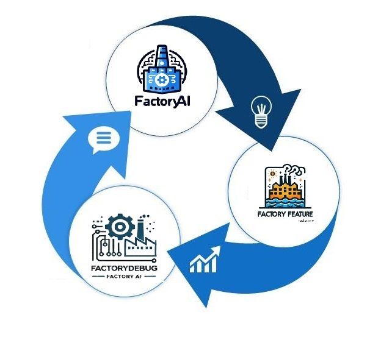

# FactoryAI Suite (Coming Soon)



**FactoryAI** is a cutting-edge suite of AI-powered tools designed to empower developers, scientists, and businesses in building and managing software projects from inception to production. Unlike traditional code generation assistants, FactoryAI is a comprehensive suite that provides an end-to-end solution for creating, enhancing, and debugging software.

The suite consists of three core programs, each addressing a distinct phase of the software development lifecycle:

1. [Factory-App-AI](https://github.com/ruslanmv/Factory-App-AI)
2. [Factory-Feature](https://github.com/ruslanmv/Factory-Feature)
3. [Factory-Debug](https://github.com/ruslanmv/Factory-Debug)

---

## Components of the FactoryAI Suite

### 1. **Factory-App-AI**
Factory-App-AI is an innovative application that enables users to dynamically generate project structures and code using generative AI models, including ChatGPT by OpenAI. It provides a user-friendly interface powered by **Gradio** to define project requirements, generate files, validate outputs, and containerize projects for deployment. 

This program streamlines project development, offering an automated workflow to build applications while allowing for manual adjustments for optimal functionality.

**Key Features:**
- **Dynamic Project Tree Generation**: Generate project structures based on user input and selected frameworks.
- **File Generation**: Automatically create files with dependency handling.
- **File Validation**: Ensure generated files are valid and meet dependency requirements.
- **File Explorer**: Inspect and browse generated files.
- **Containerization**: Automatically generate Dockerfiles and package projects as zip files for deployment.
- **Interactive Gradio Interface**: Provides a guided user experience for project creation.


---

### 2. **Factory-Feature**
Factory-Feature is a project that leverages Generative AI with **WatsonX.ai** to analyze the structure and components of an existing project. By utilizing a **Vector Database**, it efficiently retrieves project elements and updates them based on user-provided feature requests.

**How It Works:**
- The original project resides in a `project_old` folder.
- The updated project, with new features integrated, is saved in a `project_new` folder.

**Key Features:**
- **Generative AI-Powered Customization**: Uses WatsonX.ai LLM to analyze projects and intelligently integrate requested features.
- **Vector Database Creation**: Efficiently retrieves and analyzes project components.
- **Context-Aware Feature Integration**: Ensures coherent incorporation of new features.
- **Streamlined Project Updates**: Automates modifications and updates to software projects.
- **Language and Framework Agnostic**: Supports a wide range of programming languages and frameworks.

By automating tedious tasks and maintaining project coherence, Factory-Feature enables rapid and reliable customization of software projects.

---


### 3. **Factory-Debug** (Coming Soon)
Factory-Debug is a groundbreaking tool designed to transform the debugging process using AI. By analyzing provided code, Factory-Debug identifies bugs, diagnoses issues, and autonomously attempts to fix them. This tool aims to save developers time and effort, offering a streamlined solution for resolving coding problems.

**Key Features:**
- **AI-Powered Debugging**: Automatically detect and fix bugs in your code.
- **Autonomous Code Analysis**: Understand program logic to effectively diagnose issues.
- **Iterative Debugging Workflow**: Suggests and applies fixes while improving code quality iteratively.
- **Customizable Solutions**: Refine AI-generated fixes to enhance accuracy and functionality.
- **Developer-Friendly Interface**: Simple, intuitive interaction for seamless debugging.

> *Note: Factory-Debug is currently under development. Stay tuned for updates!*

---

## How It Works

The **FactoryAI Suite** uses a modular approach with three interrelated tools. Each program serves a specific purpose, yet they work together to provide a cohesive development experience:
1. Use **Factory-App-AI** to generate the foundation of your software project.
2. Enhance or modify the project with **Factory-Feature** to add custom functionality.
3. Debug and refine your project using **Factory-Debug** for production-ready solutions.

---

## Getting Started

Clone the main repository and initialize submodules to access all components of the FactoryAI suite:

```bash
git clone --recurse-submodules https://github.com/ruslanmv/FactoryAI.git
cd FactoryAI

```

### Syncronization of modules

**Make the Script Executable**
   - Open a terminal in the repository's root directory and run the following command:
     ```bash
     chmod +x sync.sh
     ```

**Run the Script**
   - Execute the script to synchronize all submodules:
     ```bash
     ./sync.sh
     ```

4. **Verify the Results**
   - After running the script:
     - All submodules will be cloned or updated in the `src` folder.
     - Check the `src` directory to confirm all submodules are present and up to date.
---

## Stay Tuned!

The **FactoryAI Suite** is under active development. Follow our progress and get ready for the future of AI-driven software development. For updates, visit [ruslanmv.com](https://ruslanmv.com).

---

## Repository Structure

The FactoryAI suite includes the following submodules:

- **[Factory-App-AI](https://github.com/ruslanmv/Factory-App-AI)**: For dynamic project generation.
- **[Factory-Feature](https://github.com/ruslanmv/Factory-Feature)**: For project feature integration and updates.
- **[Factory-Debug](https://github.com/ruslanmv/Factory-Debug)**: For AI-powered debugging and auto-fixing.

---

### License

This project is licensed under the [Apache 2.0 License](LICENSE).
